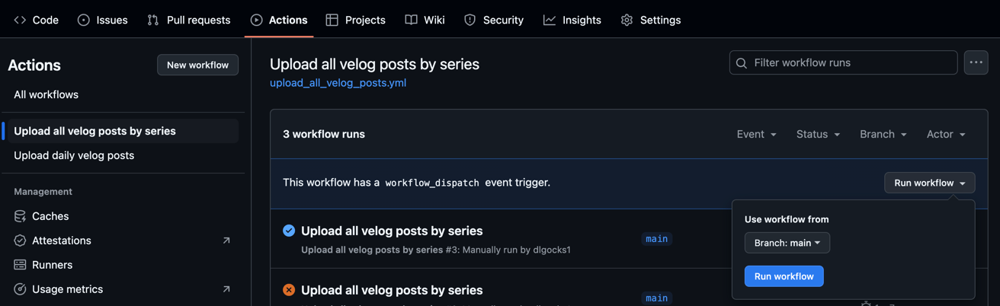

# Velog to Github Migration

> `Velog`작성 글을 `Series`기반으로 Github와 연동하는 프로젝트 입니다.

- 적용 [Sample](https://github.com/dlgocks1/Study-Velog-Post-Collections)

## 세팅

1. 프로젝트 내부의 `<<Github ID>>`, `<<Github Email>>`, `<<Velog ID>>`, `<<Current Repository Name>>`을 찾아서 변경합니다.
   

    - Current Repository는 본인 레포지토리 주소를 의미합니다.

2. `Github PAT`를 발급받아 `Github Seceret`에 등록합니다.

    - [Github Personal Access Token 발급 방법](https://velog.io/@hjthgus777/Github-Personal-Access-Token-%EB%B0%9C%EA%B8%89)
    - 레포지토리 `Settings` -> `Secretes and variants` -> `Repository secrets`
      
    - Name : `GH_PAT`, Secret : `<발급받은 토큰>`

---

## 설명

아래의 2가지 `Github Action`으로 이루어 집니다.

### `Upload all velog posts by series`

1. `Velog` 시리즈기반으로 모든 글을 깃허브와 연동하는 `Github Action` 스크립트
    1. 시리즈 정보를 활용해 폴더링 합니다.
    2. 중복이면 덮어 쒸워지도록 진행됩니다.

#### 실행 법

1. `Actions` -> `Upload all velog posts by series` -> `Run workFlow`를 진행합니다.
   

2. 레포지토리에 업로드 완료 되었는지 확인합니다.
   

### `Upload daily velog posts`

1. 매일 블로그의 N개(기본 10개)를 쿼리하여 작성되어있지 않은 글이면 작성하는 `Github Action Cron`
    1. 만약 작성한 글에 시리즈가 없다면 무시
    2. 시리즈 정보를 가져와서 폴더링
        - 이미 존재하면 무시 (제목을 기준으로 필터링합니다. 제목이 바뀔 시 중복 저장 가능)
    3. `velog graphQL API` 활용합니다.

#### 실행 법

1. 세팅을 완료하면 크론이 자동 실행됩니다.

2. 레포지토리에 업로드 완료 되었는지 확인합니다.
   

### 적용 예제

- [Study-Velog-Post-Collections](https://github.com/dlgocks1/Study-Velog-Post-Collections)